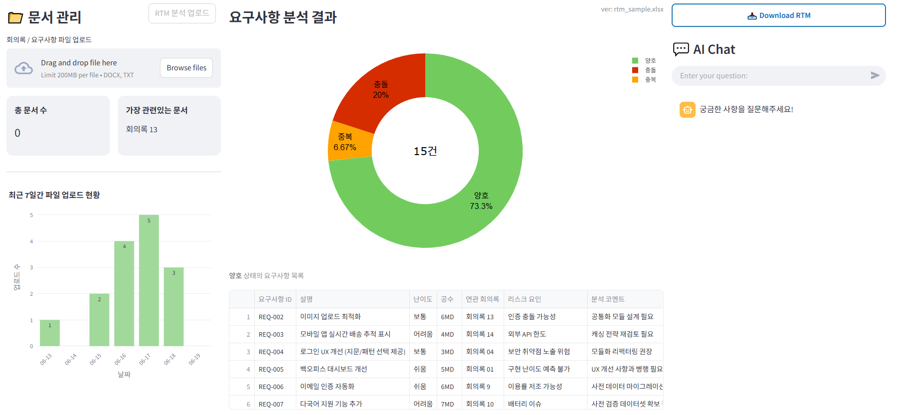
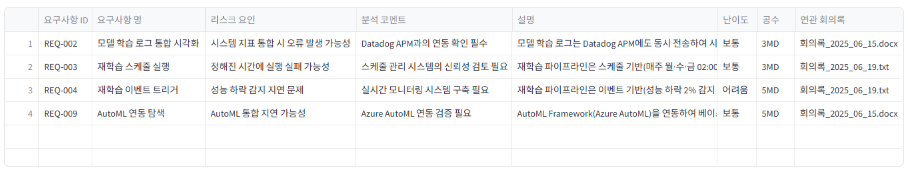
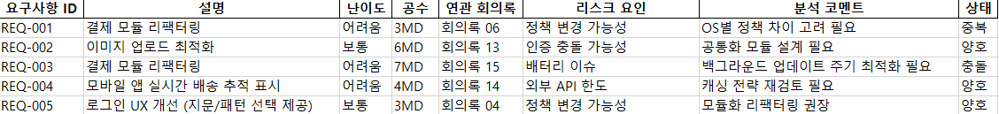
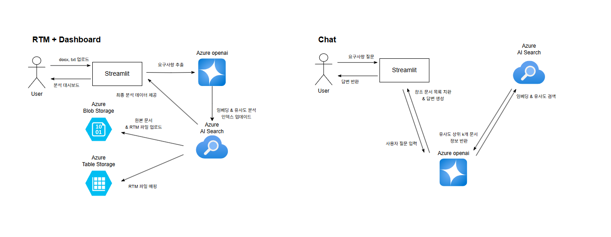

# 📁 요구사항 정리 · 정합성 분석 에이전트 (Requirement-Analyzer)
## 🔎 개요

이 애플리케이션은 회의록·요구사항 등 **비정형 문서**를 자동 분석하여

1. **요구사항 도출·정리**  
2. **기능 분류 → 개발 작업 매핑**  
3. **중복 / 충돌 / 유효 판별**  
4. **리스크 분석 + 난이도·공수 산정**  
5. **RTM(Requirements Traceability Matrix) 자동 생성**  

을 수행합니다. 결과는 **대시보드**로 시각화되며, **RAG 기반 AI 챗봇**으로 실시간 질의를 지원해 **정합성 높은 요구사항 관리**와 **프로젝트 리스크 사전 대응**을 가능하게 합니다.

## 🖥️ 주요 화면

### Dashboard


### RTM Table


### RTM Excel


> 위 이미지는 예시이며 실제 화면은 버전에 따라 다를 수 있습니다.

## 🧱 시스템 아키텍처



| 단계                                       | 기능                                                                                                                                       | 주요 기술 / 설명                                                          |
| ---------------------------------------- | ---------------------------------------------------------------------------------------------------------------------------------------- | ------------------------------------------------------------------- |
| **1. Upload**                            | **회의록 파일 업로드**<br>Streamlit을 통해 TXT / DOCX 파일 업로드 후 Azure Blob Storage에 저장                                                         | `Streamlit`, `Azure Blob Storage`                                   |
| **2. Requirement Extraction**            | **요구사항 추출**<br>업로드된 문서에서 텍스트 추출 후 `Azure OpenAI`를 이용해 초기 요구사항 목록 생성<br>→ 요구사항명, 설명, 위험 요인 등등                                               | `Azure OpenAI`                   |
| **3. Embedding & Similarity Assessment** | **중복 / 충돌 / 유사도 판단**<br>요구사항 하나씩 순회하며 벡터화 (`embedding-model`) 후 Azure AI Search를 통해 유사도 검색<br>→ 각 요구사항에 상태(양호 / 중복 / 충돌) 및 score 부여 | `Azure OpenAI Embedding`, `Azure AI Search`                         |
| **4. Excel Generation & Blob Upload**    | **RTM 엑셀 생성 및 업로드**<br>Pandas를 통해 RTM 데이터프레임 구성 → 엑셀로 저장<br>업로드된 원본 회의록과 함께 Blob Storage에 저장<br>+ 업로드 파일명 ↔ 생성 엑셀명 테이블 매핑                | `pandas`, `Azure Blob Storage`, `Azure Table Storage` |
| **5. Index Update & Dashboard**          | **벡터 인덱스 업데이트 및 대시보드 시각화**<br>새롭게 생성된 엑셀의 데이터도 Azure AI Search 인덱스에 반영<br>Streamlit + Plotly를 활용해 요구사항 품질 상태 시각화                         | `Azure AI Search`, `Streamlit`, `Plotly`, `Pandas`                  |
| **6. RAG Chat**                          | **질의응답 (RAG 기반)**<br>사용자의 질문 → 임베딩 → Azure AI Search → 관련 문서 검색 → GPT-4o-mini가 문맥 기반 답변 제공                                               | `Azure AI Search`, `Embedding`, `RAG`             |


## 🛠️ 기술 스택

| 범주 | 사용 기술 |
| --- | --- |
| **Frontend** | Streamlit, Plotly, Markdown |
| **Backend** | Python 3.11+, Pandas, Azure Table Storage |
| **AI / NLP** | Azure OpenAI, Azure AI Search |
| **파일 저장** | Azure Blob Storage |
| **배포** | Azure Web App Service |

## 🎯 기대 효과
| 효과             | 설명                     |
| -------------- | ---------------------- |
| **자동 요구사항 정리** | 수작업 대비 시간 감소        |
| **정합성 향상**     | 양호·중복·충돌 즉시 탐지            |
| **리스크 감소**     | 난이도·공수 기반 일정 버퍼 확보     |
| **산출물 자동화**    | RTM·Excel 다운로드 1‑Click |
| **지속적 개선**     | 대시보드로 품질 추세 모니터링       |

## ⚠️ 구현 / 운영 시 고려사항
| 항목                | 체크포인트                    |
| ----------------- | ------------------------ |
| **도메인 지식**        | 산업·조직 특화 프롬프트 관리         |
| **보안·Compliance** | PII 비식별화, Blob SAS 토큰 수명 |
| **대용량 성능**        | 대규모 문서 배치 임베딩 시간         |
| **UX**            | 분석 결과의 행동 가능한 가시화      |
| **RTM 포맷**        | 조직별 커스터마이즈 필요            |

## 📦 향후 개선 방향
-  유사도 판단 알고리즘 고도화

-  다중 문서 기반 추론 기능 강화 & 문서 묶음 기준으로 검색 확장

-  팀 협업을 위한 권한(Role)-기반 기능 제한(RBAC) 도입

-  프롬프트 템플릿 모듈화

## 🚀 빠른 시작
> 아래 예시는 **기본 설정**입니다.  
> Azure 리소스(ID/Key, 엔드포인트)는 실제 값으로 교체하세요.

```bash
1. resource-group 생성
2. openai 생성 -> gpt-4o-mini, embedding-model 생성
3. storage 생성 -> Blob Storage(container), Table 생성, 기초 데이터 삽입
3-1. rtm폴더에 rtm_sample.xlsx 저장
3-2. 테이블에 Patition Key(RTM), Key(rtm_sample.xlsx), Value(rtm_sample.xlsx) 저장
4. ai search 생성 -> 데이터 가져오기 및 벡터화로 기초 index 설정
```

> 아래 예시는 **로컬 실행** 기준입니다.  
**서버 실행**은 배포 가이드(deployment_guide.md)를 참고해주세요.
```bash
# 1. 의존성 설치
python -m venv venv
source venv/bin/activate   # Windows: venv\Scripts\activate
pip install -r requirements.txt

# 2. 환경 변수 (.env) 설정
# .env.sample 파일명 .env로 수정
# OpenAI, AI Search, Storage 등등 채우기
# 예시
AZURE_OPENAI_KEY="your_openai_key"

# 3. 애플리케이션 실행
streamlit run app.py
```
